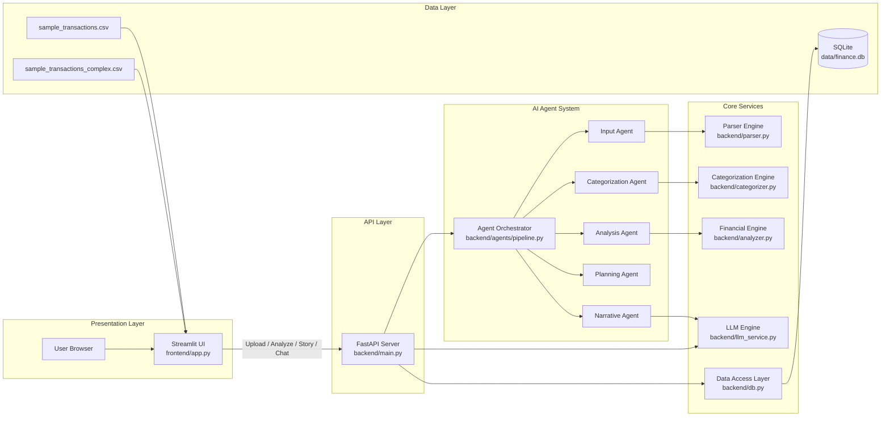
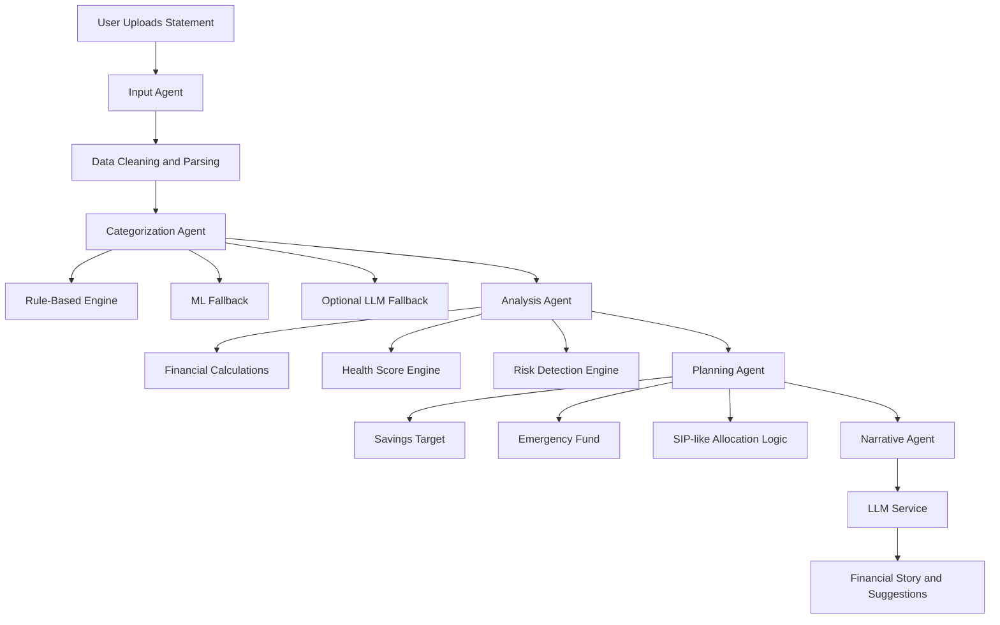

# AI Money Mentor - Hackathon Submission

AI Money Mentor is a full-stack, agent-driven personal finance prototype built for practical decision support. The application ingests bank statements, performs deterministic financial analytics, and uses a local LLM for narrative insights and result-based Q&A.

## What Great Submissions Include

### 1) Technical Depth and Architecture
- Multi-layer architecture: Streamlit frontend, FastAPI backend, modular agents, core services, SQLite data layer.
- Deterministic-first financial engine with explainable logic for score and planner outputs.
- LangGraph/LangChain orchestration with Ollama for narrative and contextual chat.



### 2) Real Business Impact
- Helps users identify savings leakage from fees, subscriptions, and untracked transactions.
- Improves financial confidence via explainable score breakdown and actionable monthly plan.
- Supports measurable KPI tracking in pilots.

| KPI | Target Direction |
|---|---|
| Savings rate uplift (3 months) | Up |
| Recurring fee events | Down |
| Unknown transaction count | Down |
| Subscription optimization | Up |
| Planner and chat engagement | Up |

### 3) Innovation
- Agent-owned financial reasoning tasks instead of a single monolithic model.
- Hybrid categorization: rules + ML, with optional LLM fallback.
- Robust LLM output handling with JSON extraction/repair.
- Local-model deployment with Ollama for low-cost reliable demos.

### 4) Live Demo Readiness
- Realistic complex statement dataset included.
- Clean category visualization (non-negative safeguard + labeled table).
- End-to-end flow ready: Upload -> Analyze -> Story -> Chat Insight.

## Agent Workflow Graph



## Tech Stack
- Frontend: Streamlit
- Backend: FastAPI
- Language: Python
- Data/ML: pandas, numpy, scikit-learn
- Parsing: pdfplumber
- LLM Orchestration: LangChain, LangGraph
- Model Runtime: Ollama (gpt-oss:20b-cloud)
- Database: SQLite

## Run Locally

1. Open terminal in app folder.
2. Install dependencies.
3. Start Ollama model.
4. Start FastAPI backend.
5. Start Streamlit frontend.

```powershell
cd app
.\.venv\Scripts\Activate.ps1
pip install -r requirements.txt
ollama run gpt-oss:20b-cloud
```

In new terminal:

```powershell
cd app\backend
uvicorn main:app --reload --port 8000
```

In another terminal:

```powershell
cd app\frontend
streamlit run app.py --server.port 8501
```

API docs: http://127.0.0.1:8000/docs
UI: http://127.0.0.1:8501

## API Endpoints
- POST /upload
- GET /analyze/{upload_id}
- POST /analyze
- POST /generate-story/{upload_id}
- POST /generate-story
- POST /chat-insight

## Repository Structure

```text
app/
	backend/
		agents/
			input_agent.py
			categorization_agent.py
			analysis_agent.py
			planning_agent.py
			narrative_agent.py
			pipeline.py
		main.py
		parser.py
		categorizer.py
		analyzer.py
		llm_service.py
		db.py
	frontend/
		app.py
	data/
		finance.db
		sample_transactions.csv
		sample_transactions_complex.csv
		schema.sql
	APP_GRAPH.mmd
	AI_Money_Mentor_Hackathon_Submission.docx
	generate_submission_doc.py
	requirements.txt
	README.md
```

## Submission Artifact
- Word submission report: AI_Money_Mentor_Hackathon_Submission.docx

## Compliance Note
This prototype is educational and does not provide specific investment advice, guaranteed returns, or fund recommendations.
